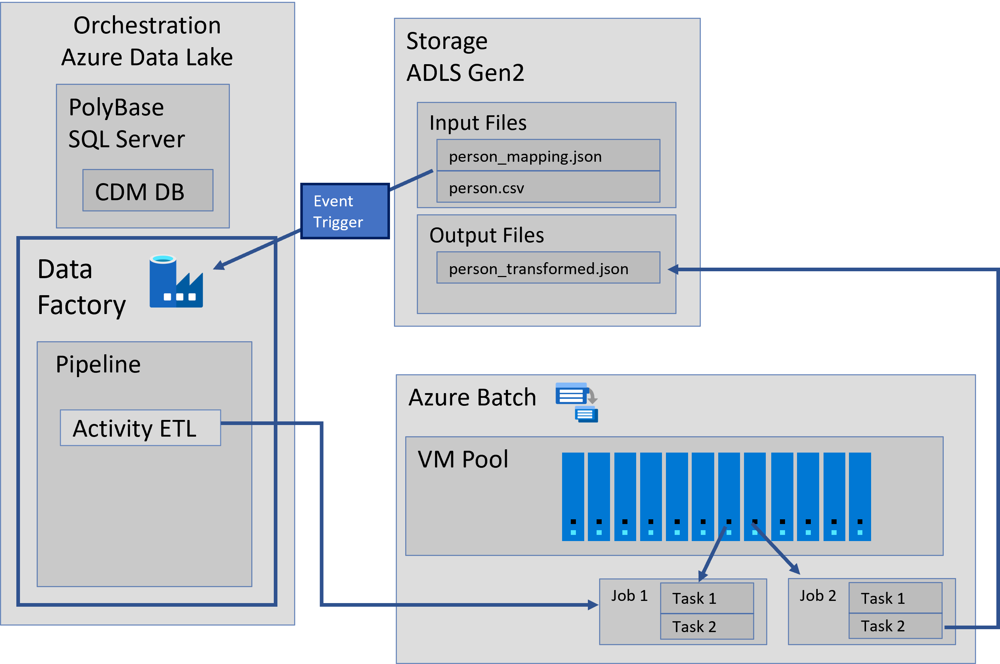
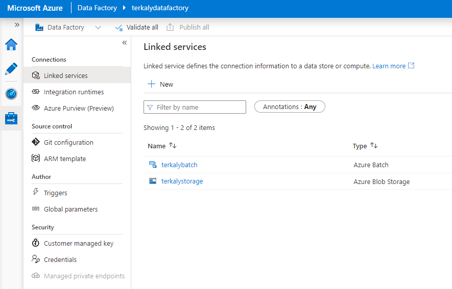
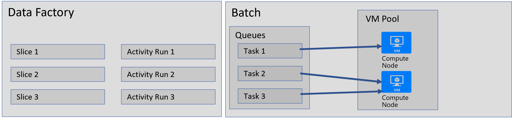
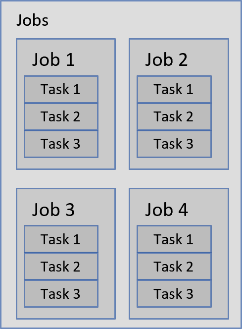

# Why Azure Batch?

Azure Batch can be used as a large-scale parallel and high-performance computing
(HPC) platform to perform ETL operations on Electronic Health Records.

machines (VMs).
You can run compute-intensive workloads across a managed collection of virtual

- Azure Batch can automatically scale compute resources to meet the needs of
  your jobs.

- You can execute your applications in parallel, and at scale.

- You don't need to manually create, configure, and manage an HPC cluster,
  individual VMs, virtual networks, or a complex job and task-scheduling
  infrastructure.

# Why Azure Data Factory?

Data Factory orchestrates and automates the movement and transformation of data.

- Data Factory can use data pipelines to move data from on-premises and cloud
  data stores to a centralized data store.

- Data Factory integrates well with Azure Blob storage.

- Data Factory can schedule data pipelines to run in a scheduled manner (for
  example, hourly, daily, and weekly).
 
- Data Factory can monitor and manage the pipelines at a glance to identify
  issues and take action.

# Data Factory and Batch together

Data Factory includes built-in activities. Here are some examples.

- The Copy activity is used to copy/move data from a source data store to a
  destination data store.

- The Hive activity is used to process data by using Hadoop clusters (HDInsight)
  on Azure.

- You also can create custom .NET or Python activities to move or process data
  with your own logic.

- You can run these activities on Batch pool of VMs.

- When you use Batch, you can configure the pool to autoscale (add or remove VMs
  based on the workload) based on a formula you provide.

# Steps to connect Azure Batch and Data Factory

1. Configure Batch with a pool of compute nodes (VMs). You can specify the
   number of nodes and the size of each node.

1. Create a Data Factory instance that is configured with entities that
   represent blob storage, the Batch compute service, input/output data, and a
   workflow/pipeline with activities that move and transform data.

1. Create a custom Python-based activity in the Data Factory pipeline. The
   activity is Python code that runs on the Batch pool.

1. Data is transformed. Data is read from Blob Storage, processed, and written
   back to blob storage.

1. Events can trigger Data Factory pipeline activities. These custom activities
   use the pool allocated by Batch. Data Factory can run activities
   concurrently. Each activity processes a slice of data. The results are stored
   in storage.

# Steps to perform

## Create an Azure Storage linked service and an Azure Batch Linked Service

# Create Datasets (input and output)

## Input and Output Datasets

In the Data Factory Editor, select the New dataset button on the toolbar. Select Azure Blob storage from the drop-down list.

Modify JSON script in the right pane with the JSON code needed to represent incoming data files.

You will specify:

- Name
- Type
- Folder Path
- Format
- PartitionBy
- Availability, Frequency

# Create and run the pipeline with a custom activity

The activity will have properties:

- name of input and output datasets
- policy
- scheduler
- name of activity

# View and Run Pipeline

The following graphic depicts what you might see.

